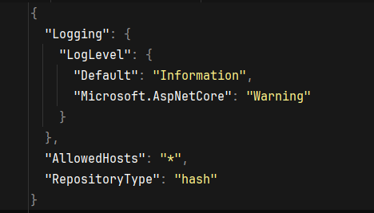
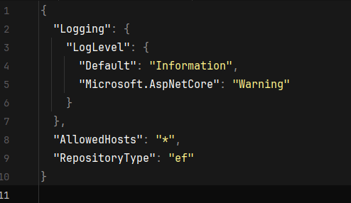

# TESTE TECNICO PEOPLE4TECH.

## Parte 1: Questões Teóricas
Todas as respostas estão aqui: [Respostas questões teóricas](/QUESTOES-TEORICAS.md)

## Parte 2: Desenvolvimento Prático - Documentação

- **Arquitetura:** Nesse projeto, decidi usar a Layered Architecture. Acredito que a forma de construir projetos em .NET usando as Solutions, se encaixa perfeitamente com os principíos da arquitetura em camadas. Por isso decidi aplicar neste projeto.

- **Estruturação:** O projeto conta com 4 Solutions, sendo elas: 
    - **P4T_API:** Aqui é a camada de apresentação do usuário (interface).     Contendo os controllers e views. Obs: Eu pensei em usar o nome Presentation, nessa solução, porém, acredito que nomeando ela como API, fica mais claro saber qual é o papel dela.
    - **P4T_Data:** A camada de Data Access do projeto. Nela temos 2 tipos de repositórios, que vou explicar logo logo.
    - **P4T_Business:** Aqui é a camada de négocio da aplicação, nela temos as models, serviços, exceptions e helpers. Tudo relacionado a lógica de negócio.
    - **P4T_Infra:** Aqui é a camada de infrastructure do projeto. Nela está presente a configuração de injeção de dependencia do container IoC do .NET Core.

## Configuração de repositórios:
Como mencionei anteriormente, nesse projeto, eu fiz duas implementações de Repository para a interface ITaskRepository. Primeiro temos a TaskInHashRepository. Essa classe é uma implementação de um banco de dados em memoria utilizando um Hash map (IDictionary).

Configurei no container IoC do .NET Core para sua instanciação ser Singleton, dessa forma, os valores são "persistidos" e mantidos a cada requisição.

E também temos a classe TaskInMemoryEfContext, essa implementação também é usada em memoria, porém, um banco em memoria fornecido pelo próprio Entity Framework, dessa forma conseguimos usar o EF para fazer as operações.

Para configurar qual banco o projeto vai utilizar, basta apenas alterar o tipo de repositório em appsettings, na chave **"RepositoryType"** :

**hash -> utiliza TaskInHashRepository.**

**ef -> utiliza TaskInMemoryEFRepository (por padrão, o projeto vai rodar em ef).**

## Tecnologias:
.NET Core, EntityFramework, DependencyInjection, Configuration e Razor

## Como utilizar:
Basta rodar a solução **P4T_API** e acessar o endpoint https://localhost:44337/. Nele vai estar a interface da aplicação.

## Agradecimentos
Quero agradecer pela oportunidade. Me esforcei bastante para que este projeto atenda o que é esperado de você!